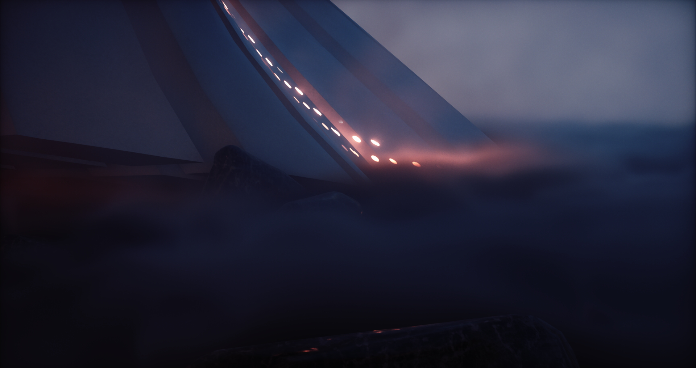

<div align="center">

# PK Renderer

**A physically based real-time renderer made with C++, GLSL & Vulkan.**
</div>

The project's goal is to be a feature rich & performant renderer without any precomputed scene structures or light transport. Visually it aims to be as close as possible to path-traced reference lighting. Feature wise it aims to maintain a suite of modern rendering techniques and features commonly found in games & rendering software.  However, it is ultimately a hobby project & thus likely to remain perpetually a work in progress.

<div align="center">
  
## Previews

</div>

<p align="center">
  
  
  
  
  
  
</p>

--- 

## Features

<details>
  <summary>Ray Traced Global Illumination</summary>

- Screen space radiance cache (for ray traced radiance).
- Voxel cone traced world space radiance cache.
- Basic ReSTIR for diffuse hits.
- Recurrent blur denoiser.
- Volumetrics integration.
- Rough specular approximation from diffuse SH1.
- Async TLAS & BLAS builds.

</details>

<details>
  <summary>Analytic Lights</summary>
  
  - Spot, point & directional lights.
  - Variance shadow maps.
  - Directional shadow cascades.
  - Clustered forward rendering.
  
</details>


<details>
  <summary>Shading</summary>

  - PBR BRDF (GGX, Disney diffuse, Smith correlated).
  - PBR volumetric fog.
  - Octahedron mapped GGX HDR IBL.
  - Spherical harmonics convolution from from IBL (for volumetrics).
  - GBuffers (normals, roughness, min/max/avg hierarchical depth).
  
</details>

<details>
  <summary>Post Processing</summary>

  - Temporal antialiasing.
  - HDR bloom.
  - Luminance histogram based auto exposure.
  - Bokeh depth of field & auto focus.
  - Filmic ACES  tone mapping.
  - Color grading.
  - Film grain.
  - Vignette.
  
</details>

<details>
  <summary>Architecture</summary>

  - Vulkan 1.3 rendering backend.
  - Async compute & transfer queues.
  - Multiple buffering.
  - Automatic resource barrier management.
  - Dynamic scene material batching & instanced rendering.
  - Virtualized mesh geometry buffers.
  - Entity component system.
  - Custom compressed mesh & shader formats.
  - Asset hot reloading
  - Console command interface.
  
</details>

<details>
  <summary>Planned</summary>

- skinned geometry.
- GPU culling.
- SH probe based world space radiance cache.
- GPU particle engine.
- Debug visualization utilities.
- DX12 backend (unlikely... cant do async ray trace afaik).
- Serialized scene representation.
- DX12 Rendering backend.
  
</details>

## Dependencies

<details>

<summary>Required Vulkan & GLSL Features & Extensions</summary>

<br/>

```
Vulkan Version 1.3

GLSL Extensions:
- GL_EXT_shader_explicit_arithmetic_types
- GL_EXT_nonuniform_qualifier
- GL_ARB_shader_viewport_layer_array
- GL_EXT_ray_tracing
- GL_KHR_shader_subgroup_ballot
- GL_EXT_control_flow_attributes

Validation layers:
- VK_LAYER_KHRONOS_validation

Instance Extensions:
- VK_EXT_debug_utils
- VK_KHR_get_physical_device_properties2

Device Extensions:
- VK_KHR_surface
- VK_KHR_win32_surface
- VK_KHR_swapchain
- VK_KHR_deferred_host_operations
- VK_KHR_acceleration_structure
- VK_KHR_ray_tracing_pipeline
- VK_KHR_ray_query
- VK_EXT_conservative_rasterization

Physical Device Requirements:
- alphaToOne
- shaderImageGatherExtended
- sparseBinding
- sparseResidencyBuffer
- samplerAnisotropy
- multiViewport
- shaderSampledImageArrayDynamicIndexing
- shaderUniformBufferArrayDynamicIndexing
- shaderFloat64
- shaderInt16
- shaderInt64
- imageCubeArray
- fragmentStoresAndAtomics
- multiDrawIndirect
- storageBuffer16BitAccess
- uniformAndStorageBuffer16BitAccess
- storagePushConstant16
- shaderUniformBufferArrayNonUniformIndexing
- shaderSampledImageArrayNonUniformIndexing
- runtimeDescriptorArray
- descriptorBindingVariableDescriptorCount
- descriptorBindingPartiallyBound
- scalarBlockLayout
- shaderFloat16
- shaderInt8
- shaderOutputViewportIndex
- shaderOutputLayer
- bufferDeviceAddress
- timelineSemaphore
- hostQueryReset
- accelerationStructure
- rayTracingPipeline
- rayQuery
- maintenance4
```

</details>

<details>

<summary>Libraries & Dependencies</summary>

- [PKAssetTools](https://github.com/konstatoivanen/PKAssetTools)
- [KTX](https://github.com/KhronosGroup/KTX-Software)
- [yaml-cpp](https://github.com/jbeder/yaml-cpp)
- [GLFW](https://www.glfw.org/)
- [GLM](https://github.com/g-truc/glm)
- [mikktspace](http://www.mikktspace.com/)
- [VMA](https://github.com/GPUOpen-LibrariesAndSDKs/VulkanMemoryAllocator)

</details>

## Platform & Build Support

> **Warning**
> the project has only been tested on Windows 10, support for systems or versions is untested.

> **Warning**
> the project has only been tested on an NVIDIA RTX 2080 TI, support for other vendors or devices is untested.

> **Warning**
> building requires MSBuild, MSCV & a C++17 standard compatible system.

> **Warning**
> building only the PKRenderer project requires a build of PKAssetTools or compatible prebuilt binaries.

Build using MSBuild CLI:

`msbuild.exe PKRenderer.sln /property:Configuration=Release`  or

`msbuild.exe PKRenderer.sln /property:Configuration=Debug` or

through Visual Studio (you know how that goes).
