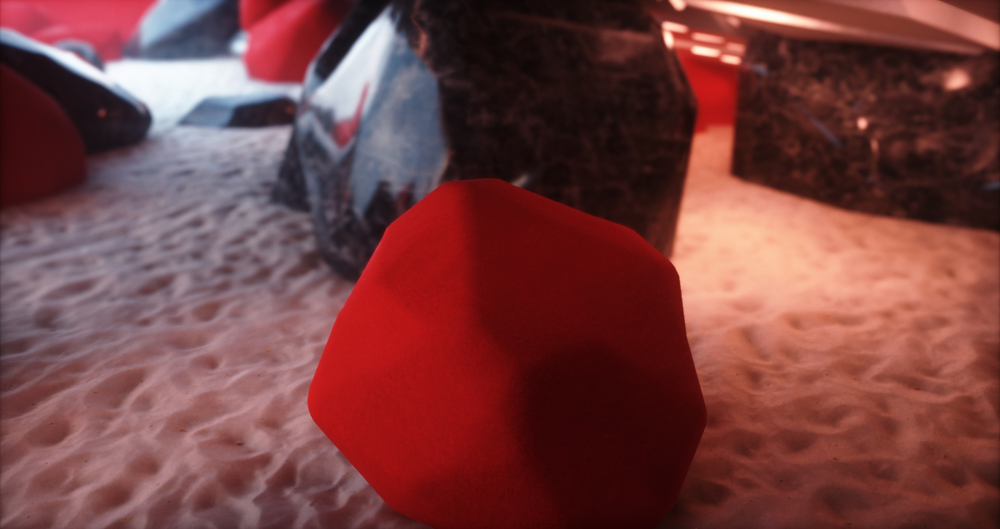
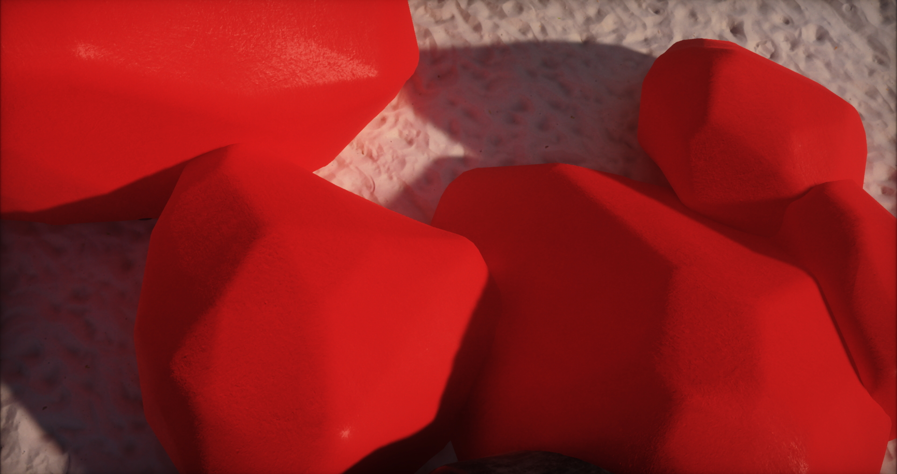
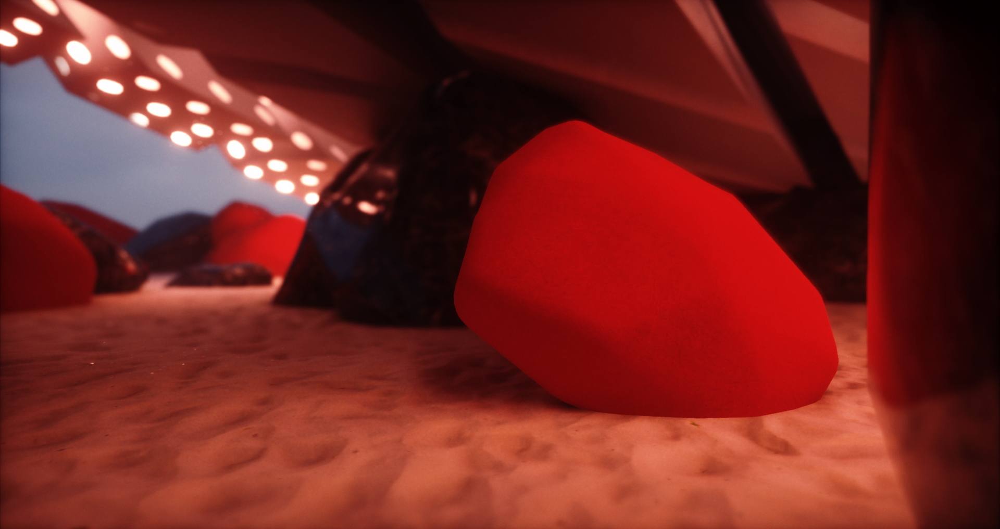

<div align="center">

# PK Renderer

**A physically based real-time renderer made with C++, GLSL & Vulkan.**
</div>

The goal of this project is to be a feature rich & performant renderer without any precomputed scene structures or light transport. 
The visual target is to get as close as possible to path-traced reference lighting.
The performance target is to stay at a stable 6.94ms/144hz framerate at 1080p on a RTX 2080 TI.
However, this is ultimately a hobby project & thus likely to remain perpetually a work in progress.

<div align="center">
  
## Previews

</div>

<p align="center">
  
  
  
  
  
  
  
  
</p>

--- 

## Features

<details>
  <summary>Ray Traced Global Illumination</summary>

- Screen space radiance cache (for ray traced radiance).
- Voxel cone traced world space radiance cache.
- Basic ReSTIR for diffuse hits.
- Recurrent blur denoiser.
- Volumetrics integration.
- Rough specular approximation from diffuse SH1.
- Async TLAS & BLAS builds.

</details>

<details>
  <summary>Analytic Lights</summary>
  
  - Spot, point & directional lights.
  - Spherical area light estimation for all types.
  - Poisson PCF shadow filtering.
  - PCSS shadow filtering for directional lights.
  - [Bend screen space shadows.](https://www.bendstudio.com/blog/inside-bend-screen-space-shadows/)
  - Directional shadow cascades.
  - Clustered forward rendering.
  
</details>


<details>
  <summary>Shading</summary>

  - PBR BxDF
    - Chan Diffuse term
    - GGX normal distribution term.
    - Smith GGX correlated visibility term.
    - Hanrahan Krueger sub surface term.
    - Clear coat support.
    - Sheen support.
  - PBR volumetric fog.
  - Octahedron mapped GGX HDR IBL (used for rt & sky).
  - Spherical harmonics convolution from from IBL (for volumetrics).
  - GBuffers (normals, roughness, min/max/avg hierarchical depth).
  
</details>

<details>
  <summary>Post Processing</summary>

  - Temporal antialiasing.
  - HDR bloom.
  - Luminance histogram based auto exposure.
  - Bokeh depth of field & auto focus.
  - GT Uchimura tone mapping.
  - Color grading.
  - Film grain.
  - Vignette.
  
</details>

<details>
  <summary>Meshlet Rendering</summary>
  
  - 16 byte vertex packing.
    - unorm 16 xyz vertex position relative to submesh aabb.
    - r4g4b4 color
    - tangent sign 1 bit
    - half2 texcoord
    - 10r10b10g2a quaternion.
  - directed acyclic graph lod levels.
  - task shader cone culling.
  - task shader frustum culling.
  - global virtual buffers for all geometry resources.
  - dynamically batched draw calls.
  - material batching.
    - all material properties in a single buffer.
    - shader specific property layout & offset to property buffer.

</details>

<details>
  <summary>Architecture</summary>

  - Vulkan 1.3 rendering backend.
  - Async compute & transfer queues.
  - Multiple buffering.
  - Automatic resource barrier management.
  - Entity component system.
  - Custom compressed mesh & shader formats.
  - Asset hot reloading
  - Console command interface.
  
</details>

<details>
  <summary>Planned</summary>

- skinned geometry.
- GPU culling.
- SH probe based world space radiance cache.
- GPU particle engine.
- DX12 backend (unlikely... cant do async ray trace afaik).
- Serialized scene representation.
  
</details>

## Dependencies

<details>

<summary>Required Vulkan & GLSL Features & Extensions</summary>

<br/>

```
Vulkan Version 1.3
SPRIV Version 1.6

GLSL Extensions:
- GL_EXT_shader_explicit_arithmetic_types
- GL_EXT_nonuniform_qualifier
- GL_ARB_shader_viewport_layer_array
- GL_EXT_ray_tracing
- GL_KHR_shader_subgroup_ballot
- GL_EXT_control_flow_attributes
- GL_KHR_shader_subgroup_ballot
- GL_KHR_shader_subgroup_arithmetic
- GL_KHR_shader_subgroup_shuffle
- GL_KHR_shader_subgroup_vote
- GL_EXT_ray_tracing_position_fetch
- GL_EXT_mesh_shader
- GL_EXT_shader_image_load_formatted

Validation layers:
- VK_LAYER_KHRONOS_validation

Instance Extensions:
- VK_EXT_debug_utils
- VK_KHR_get_physical_device_properties2

Device Extensions:
- VK_KHR_surface
- VK_KHR_win32_surface
- VK_KHR_swapchain
- VK_KHR_deferred_host_operations
- VK_KHR_acceleration_structure
- VK_KHR_ray_tracing_pipeline
- VK_KHR_ray_query
- VK_EXT_conservative_rasterization
- VK_KHR_ray_tracing_position_fetch
- VK_EXT_mesh_shader
- VK_KHR_fragment_shading_rate

Physical Device Requirements:
- alphaToOne
- shaderImageGatherExtended
- sparseBinding
- sparseResidencyBuffer
- samplerAnisotropy
- multiViewport
- shaderSampledImageArrayDynamicIndexing
- shaderUniformBufferArrayDynamicIndexing
- shaderFloat64
- shaderInt16
- shaderInt64
- imageCubeArray
- fragmentStoresAndAtomics
- multiDrawIndirect
- shaderStorageImageReadWithoutFormat
- shaderStorageImageWriteWithoutFormat
- storageBuffer16BitAccess
- uniformAndStorageBuffer16BitAccess
- storagePushConstant16
- shaderUniformBufferArrayNonUniformIndexing
- shaderSampledImageArrayNonUniformIndexing
- runtimeDescriptorArray
- descriptorBindingVariableDescriptorCount
- descriptorBindingPartiallyBound
- scalarBlockLayout
- shaderFloat16
- shaderInt8
- shaderOutputViewportIndex
- shaderOutputLayer
- bufferDeviceAddress
- timelineSemaphore
- hostQueryReset
- accelerationStructure
- rayTracingPipeline
- rayQuery
- maintenance4
- rayTracingPositionFetch
- taskShader
- meshShader
- multiviewMeshShader
- primitiveFragmentShadingRateMeshShader
- pipelineFragmentShadingRate
```

</details>

<details>

<summary>Libraries & Dependencies</summary>

- [PKAssetTools](https://github.com/konstatoivanen/PKAssetTools)
- [Vulkan](https://github.com/KhronosGroup/Vulkan-Headers)
- [KTX](https://github.com/KhronosGroup/KTX-Software)
- [rapidyaml](https://github.com/biojppm/rapidyaml/tree/master)
- [GLM](https://github.com/g-truc/glm)
- [mikktspace](http://www.mikktspace.com/)
- [VMA](https://github.com/GPUOpen-LibrariesAndSDKs/VulkanMemoryAllocator)
- [Bend screen space shadows](https://www.bendstudio.com/blog/inside-bend-screen-space-shadows/)

</details>

## Platform & Build Support

> **Warning**
> The project has only been tested on Windows 10, support for systems or versions is untested.

> **Warning**
> The project has only been tested on an NVIDIA RTX 2080 TI, support for other vendors or devices is untested.

> **Warning**
> Building requires MSBuild and a C++17 standard compatible version of MSCV or clang-cl.

> **Warning**
> Building only the PKRenderer project requires a compatible build of PKAssetTools.

Build using MSBuild CLI:

`msbuild.exe PKRenderer.sln /property:Configuration=Release`  or

`msbuild.exe PKRenderer.sln /property:Configuration=ClangRelease`  or

`msbuild.exe PKRenderer.sln /property:Configuration=Debug` or

`msbuild.exe PKRenderer.sln /property:Configuration=ClangDebug` or

through Visual Studio (you know how that goes).

Transfer to a more portable build system is planned but has a very low priority.
